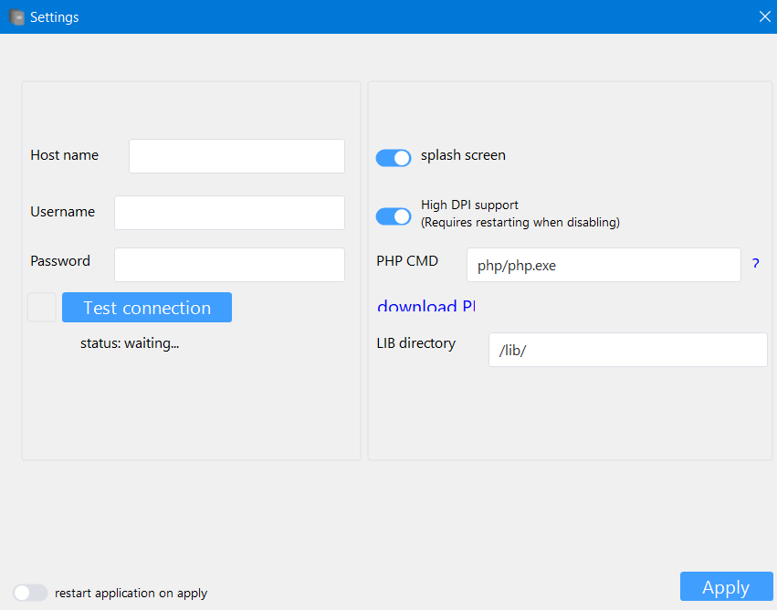
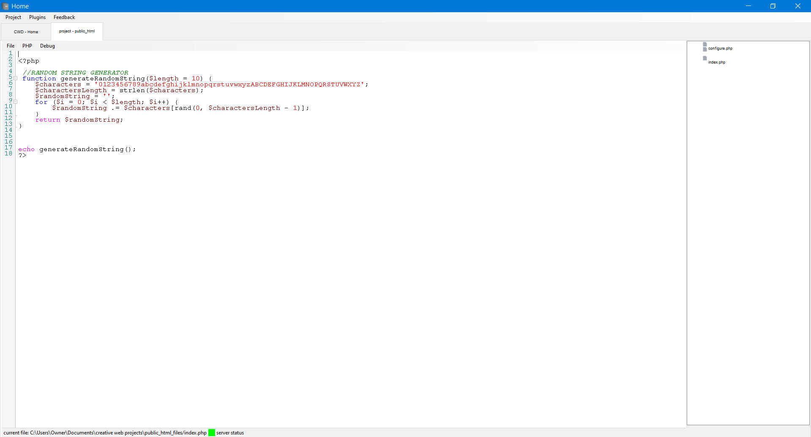
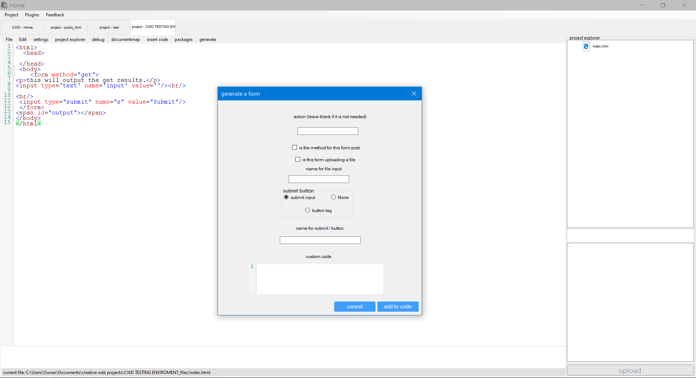

# CWD (creative web develop)
creative web develop is a IDE designed for website designers and programmers.

# Required Software
- Visual studio 2019+

# Creative Web Development features

- inbuilt editor
- run multiple projects at once
- preview files from images to text
- php projects
- backend plugins
- form generation
- php debugging
- user score
- feedback

# Screenshots

